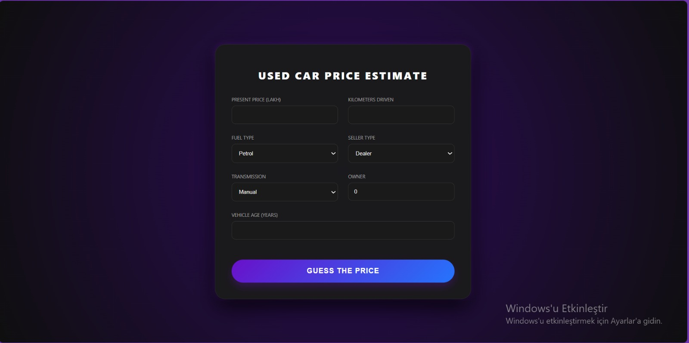

# 🚗 USED CAR PRICE ESTIMATE

This project is a Machine Learning web application that predicts used car prices.

## 🚀 Screenshots

## 🛠️ Features
- **Machine Learning:** Random Forest model trained on car data.
- **Backend:** FastAPI for high-performance predictions.
- **UI:** Modern, dark-purple themed interface.

## 💻 How to Run
1. Install requirements: `pip install -r requirements.txt`
2. Start server: `uvicorn app:app --reload`
